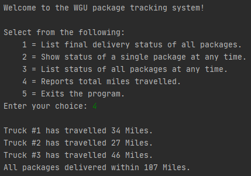
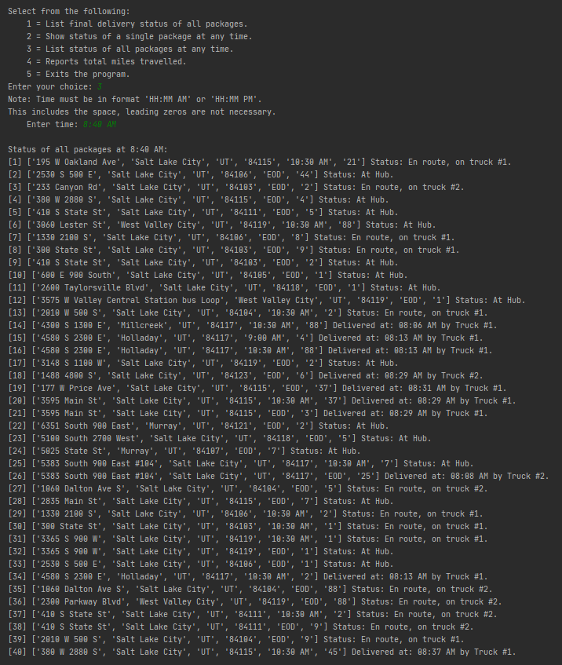
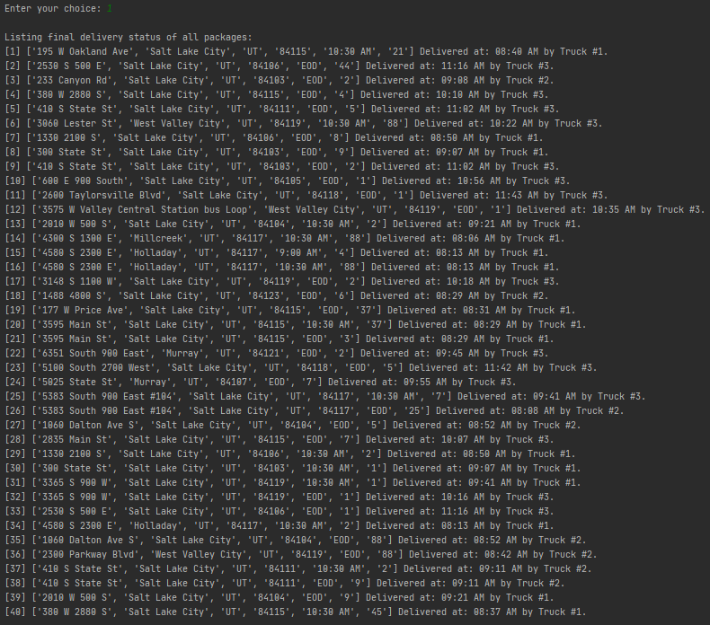

# PackageSimulation
A Python project that simulates efficient package delivery using a self-adjusting greedy algorithm. This project was created for the Data structures and Algorithms II course as an exploration of space-time complexity and big-O.

  This application uses a CSV file of addresses and a "distance" matrix to generate a virtual map of locations that can then be traversed by an algorithm to determine shortest possible routes. The application is also fed a CSV file of packages that have start and end locations. Distances are converted to miles travelled to simulate the speed that the vehicle can deliver these packages.
  
  The algorithm traverses all paths necessary to deliver all packages within the "package_data.csv" file. The GUI is command-line based and is capable of listing the final delivery status of all packages. The status of any package can be queried at any time frame.
  
  The runtime complexity of the entire program is as follows:  
The csv files are imported within the ‘distances.py’ file, running in 3N or O(N). The simulation runs by instantiating the first two trucks and running the ‘greedy_driver’ algorithm, correcting the incorrect address using the ‘correct_address’ function, before instantiating the third truck and running its algorithm. This takes 6N^3 + 1 operations, with a complexity of O(N^3). The last running operation is the user interface running in O(N^3). Overall space-time complexity of the program is O(N^3). 

   
  
  
   
  
  
   
  
  
